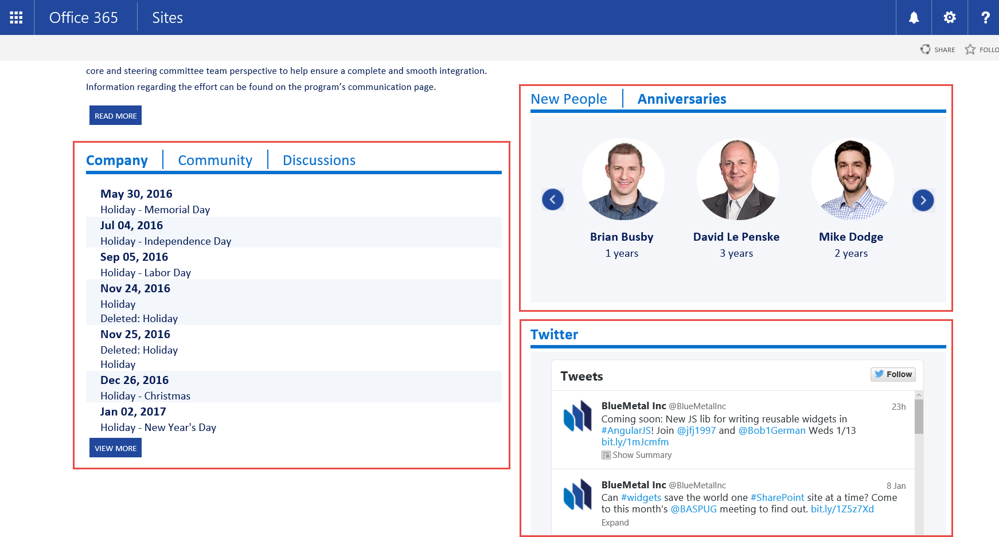
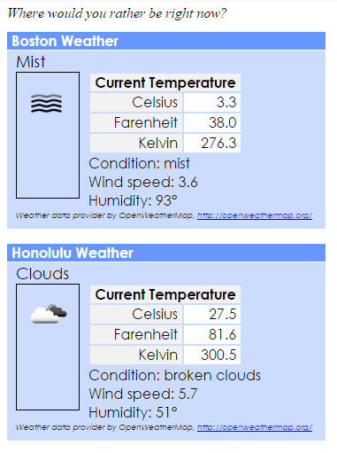

# Widget Wrangler

## What’s a widget, and why should I care?
In economics, a [widget](https://en.wikipedia.org/wiki/Widget_(economics)) is a name for a generic gadget
or manufactured good; on the web, a [widget](https://en.wikipedia.org/wiki/Web_widget) is a generic
piece of web functionality running on a page.
What makes widgets special is that, unlike controls in
ASP.NET or directives in AngularJS, widgets are generally
released separately from the web page that hosts them, and
are often deployed by end users.

If you’re reading this blog, you probably know something about
Microsoft SharePoint, and this might sound familiar.
A widget is a lot like a web part, only much lighter weight. In fact,
widgets can easily be hosted in content editor web parts, on a
list form, in a SharePoint add-in, or outside of SharePoint.
If you're careful, you can reuse the same widget
in all those contexts!

_Widgets on the BlueMetal intranet_

Any snippet of HTML with JavaScript can be considered a widget,
however good widgets have additional attributes:

* They're isolated so they won't interfere with the web page that
hosts them, or with other widgets on the page. Ideally multiple copies
of a widget can run on a page with no interference.

* They load efficiently so users don't have to wait a long time for them
to render on the page.

* They're self contained so they can be reused easily. A widget that
depends on various script tags, CSS files, and other elements on a page
is more brittle and harder to reuse than a widget that is contained within
a single HTML element.

* They're developed using the power of modern JavaScript frameworks such
as AngularJS for supportability and testability. (This is purely optional,
however, and this article will also explore widgets written in jQuery or
plain JavaScript.)

## Introducing Widget Wrangler

Today my colleague [Julie Turner](https://twitter.com/jfj1997) and I
are pleased to announce a new, light-weight JavaScript library for
managing widgets called the Widget Wrangler. It's available now
[on Github](https://github.com/Widget-Wrangler/ww) for your widget
wrangling pleasure. It's also part of the new 
[JavaScript Core](https://github.com/OfficeDev/PnP/tree/master/Samples/Core.JavaScript)
in the January 2015 release of Microsoft's
[OfficeDev Patterns and Practices](https://github.com/OfficeDev/PnP)
library (hence the filename _pnp-ww.js_).

A widget consists of a single HTML element (the _widget root_ - 
usually a &lt;div&gt;) that contains HTML for the widget, and a
script tag that references the Widget Wrangler. The script tag
includes custom attributes that tell Widget Wrangler what JavaScript
to load and how to "boot" the widget.

For example:

    

        

            <h1>Hello {{vm.name}}</h1>
        

        
    

The Widget Wrangler (pnp-ww.js) will load in-line, and will take care of
loading the scripts the widget needs (in this case Angular and script.js)
and bootstrapping the AngularJS application. The custom attributes tell
Widget Wrangler how to load the widget:

Tag | Required | Description
---|---|---
ww-appname | yes | Used to create a name for the app. In the case of an Angular widget, this is the module that will be passed to the angular.bootstrap function when starting the widget.
ww-apptype | no | Currently "Angular" is the only supported framework that will auto-bind upon load completion. 
ww-appbind | no | The function to be executed when all the script files have completed loading.
ww-appscripts | yes | A JSON object that will be used to load the additional javascript libraries.  Define a src property for each script containing the location of the script file (using ~/ in the source tag specifies the file is in the same location as the pnp-ww.js file specified above.  Priority is the load priority, this is a 0 based list of implied load order.  Multiple source files may have the same priority if they do not depend upon each other to execute.) Use the priority property to specify a numeric priority. Priorities must begin at 0 and be defined in order (0, 1, 2 ...). Multiple scripts can be given the same priority in order to load them concurrently.

NOTE: It is necessary to specify ww-apptype (for an Angular widget) OR 
ww-appbind (to do the binding yourself).

The ww-appscripts element contains a JSON object that tells Widget Wrangler
what scripts to load before bootstrapping the widget. This is a collection of
objects in which each object contains properties as follows:

Tag | Required | Description
---|---|---
src | yes | URL of the script to be loaded; this can be absolute, relative to the page, or by using a tilde prefix, relative to the pnp-ww.js script (for example, src=~myscript.js)
priority | yes | An integer indicating the priorty of the script; first priority 0 scripts will be loaded, then priority 1, etc. Priorities must begin at 0 and not skip any numbers, and scripts in the collection are expected to be in priority order.

A widget can either run as an AngularJS application, which is bound to the widget root,
or using a custom binding function specified in the ww-appbind attribute. In the latter
case, the widget root element is passed to the binding function so the widget can
access the browser DOM relative to the widget root instead of having to find it
on the page. This helps to isolate the widget. For example, it's common practice to
hard-code an HTML element ID and then find it with jQuery; this works fine for one
widget, but prevents multiple widgets with the same ID.

Widget Wrangler has no dependencies on SharePoint or other script libraries, and works with the same
browsers as AngularJS. With the exception if IE8, which is not currently supported,
the Widget Wrangler works with the same browsers as SharePoint 2013.

Widget Wrangler tries to load the scripts needed by each widget as efficiently as
possible, and will only load each script once even if it's used in multiple widgets.
(NOTE: The current implementation determines what scripts are the same using their
URL; a future version may be smart enough to identify multiple versions of common
libraries at different URL's.) Use the "priority" property in the ww-appscripts
attribute to control parallel script loading; for example all priority 0 scripts will
load in parallel, followed by priority 1 scripts, etc. Priority numbers must begin at 0
and must be contiguous (e.g. 0, 1, 2...) In the example above, script.js depends on
AngularJS, so AngularJS is given priority 0 (and loads first), and script.js is loaded
only when Angular (and any other priority 0) scripts are loaded.

The main repository for the Widget Wrangler is [here](https://github.com/Widget-Wrangler/ww);
it's also a part of the OfficeDev Patterns and Practices Library
[here](https://github.com/OfficeDev/PnP/tree/master/Samples/Core.JavaScript).
Please use the main repository for access to the Widget Wrangler tester and for
pull requests.

## Widgets and JavaScript Frameworks

Widgets can be written using any number of JavaScript frameworks; this section will
explore some of the most popular.

### AngularJS Widgets

AngularJS is a favorite framework to use with widgets, mainly because of its MV*
design pattern and rich selection of services and directives. However AngularJS
was really designed for single-page applications (SPAs) that take over an entire
web page. A typical AngularJS application is "auto-bootstrapped" using the ng-app directive;
while this is fine for SPAs, the 
[documentation](https://docs.angularjs.org/api/ng/directive/ngApp#!) clearly states
that you can only have one ng-app directive on a page.

To get around this limitation and allow many widgets on a page, the Widget Wrangler 
uses the angular.bootstrap() function; there
is no hard limit on the number of Angular apps that can run on a page using this method.

(NOTE: If you want to use Widget Wrangler in a page that already uses AngularJS,
ensure that the widget doesn't overlap the existing Angular application - i.e. it can't
be inside the element that is decorated with ng-app. Also ensure the versions of Angular
are the same or similar enough that both the SPA and widget(s) will work with either
one.)

You can find a simple AngularJS widget at [http://bit.ly/ww-ng1](http://bit.ly/ww-ng1). 
This sample uses [Plunker](http://plnkr.co/) so you can run and experiment
with the code right in your web browser. In this sample you'll see two
instances of a Hello World widget which vary only in their view so one of them
says goodbye instead of hello. This shows how to embed the view right into
the widget so you can make each instance render differently.

_Weather Widgets_

A slightly more advanced example can be found at [http://bit.ly/ww-ng2](http://bit.ly/ww-ng2).
This example shows a weather forecast, and demonstrates how to pass configuraiton
information - in this case the location of the weather forecast - into the
application via the ng-init directive in the view. It also shows how to use
ng-include to place the view in an HTML template so it's shared by all
instances of the widget.

  <!-- Weather widget for Boston, MA -->  
  

    

        <h1>{{vm.City}} Weather</h1>
    
        

    
        

          {{vm.error}}
        

    

  
     
  

The Angular controller includes a function to pull in the weather as soon
as Angular processes the ng-init binding:

      (function() {
  
          angular
            .module('WeatherApp', [])
            .controller('main', ['$scope', 'weatherService',
              function ($scope, weatherService) {

                var vm = this;
        
                $scope.$watch(vm.query, function() {
                weatherService.GetWeather(vm.query)
                  .then(function(data) {

                    // Copy data from the service into the model
                    vm.City = data.City;
                    vm.Condition = data.Condition;
                    vm.Description = data.Description;
                    vm.IconUrl = data.IconUrl;
                    vm.Temperatures = data.Temperatures;
                    vm.Wind = data.Wind;
                    vm.Gusts = data.Gusts;
                    vm.Humidity = data.Humidity;

                    // If we got this far, we have good data
                    vm.ValidDataLoaded = true;

                  })

                .catch (function(message) {

                    vm.error = message;
                    vm.ValidDataLoaded = false;

                  });
                });
        
              }
            ]); // End Controller()
    }());

A third example at [http://bit.ly/ww-ng3](http://bit.ly/ww-ng3) shows how
to connect two Angular widgets. This is accomplished via a service that relays
messages in the form of JavaScript objects from senders to receivers 
over named channels. 

If you look at the code you may notice that this
service communicates via a shared object that hangs off the window object.
Normally in Angular
a service could store such an object locally, and the service (declared as a
factory) would be shared by all who reference it. But that doesn't work here
since each widget is a completely separate Angular application. Modules,
services, etc. with the same names are all isolated completely within each
widget, and Angular does a great job keeping them seperate. In the sample,
each sender and receiver widget gets its own
service instance, so information is shared outside of Angular in the window
object.

### Knockout Widgets

KnockoutJS is another great example of an MVVM style JavaScript library.
There's an example of simple Knockout widgets at
[http://bit.ly/ww-ko1](http://bit.ly/ww-ko1). 
There are two instances of the widget on the page to demonstrate isolation;
here is one of the widgets:

    

      <h1>Knockout Widget 1</h1>
      
Enter a secret message:
        <input data-bind="textInput: message, event: {keyup: messageChanged}" />
      

      
<i>
          (psssst - don't tell other widgets, but the message was:
          
          )
      </i>

       
    

Notice that this time the ww-appBind attribute is specified; this contains
the binding function myWidget.Load. script.js contains this function:

    var myWidget = myWidget || {};

    // Prototype for a ViewModel
    myWidget.vm = function() {
  
        this.message = ko.observable("");
        this.hideMessage = ko.observable(true);
    
        this.messageChanged = function () {
            this.hideMessage(this.message() === '');
        };
    }

    myWidget.Load = function (element) {
        // Make a new ViewModel for each widget instance
        ko.applyBindings(new myWidget.vm(), element);
    }

Notice how the binding function uses the new keyword to make a new
ViewModel object for each widget; without this, isolation would
be lost and all the widgets would share the same ViewModel and data.

### jQuery Widgets

Here's an example that not only shows a jQuery widget, but demonstrates how 
to take existing jQuery code and make it into a Widget. In this case, it's based
on [this jQuery UI example](https://jqueryui.com/slider/#colorpicker) of
a color picker. The original sample includes several references to
specific element ID's, so the code would need to be modified to handle
more than one color picker on a page.

_jQueryUI sample made into a widget, now supports multiple instances on a page_

You can see the widget version at [http://bit.ly/ww-jq1](http://bit.ly/ww-jq1).
As you can see, there are two instances of the widget on the page; all the
code is shared yet they
work independently. To make this work, the following code changes were
needed:

 * Change the element ID's to classes, so it's legal to have more than one
 * Add a bootstrap function similar to the Knockout example, that creates a new "controller" for each widget instance
 * When the widget bootstraps, pass the element into the jQuery code and reference the elements relative to the element. For example, $('#red') becomes $(element).find('.red')

### Plain JavaScript Widgets

Sometimes less is more, and plain JavaScript is better and faster than using
even a light-weight library like jQuery. If you want to use Widget Wrangler
on its own, without any other libraries, check out the example at
[http://bit.ly/ww-js1](http://bit.ly/ww-js1). This is a widget that Ford
Prefect would love!
      
Notice that it uses the new keyword in the binding
function to create a new object for each widget instance. It also
generates a unique index for each instance that's used in a button
click attribute. This index is passed into the click event handler to allow
it to find the correct instance when the event fires.

## Widgets in SharePoint

The Patterns and Practices library includes
[an example](https://github.com/OfficeDev/PnP/tree/master/Samples/Provisioning.MicroSurvey)
that shows how to use widgets in various kinds of SharePoint projects.
The example is a Microsurvey that asks a single question, then shows a
simple graph of all the responses to that quesiton.

_Microsurvey Widget - Question and Results Views_

The example can be
packaged and deployed three ways:

 * As a SharePoint Hosted Add-in
 * Directly in a SharePoint site using drag-and-drop deployment by and end user
 * Directly in a SharePoint site using PowerShell deployment from a central site, so a single copy of the solution can be used in many sites. This has the advantage that the solution can be updated in one place and the change will be immediately available in all sites.

The solution includes a web part and custom new, edit, and display forms for
managing the list of questions. It's also smart enough to deploy its own
list storage using JavaScript, so the questions and answers lists are
generated the first time the solution is used.

Widgets allow a high degree of reuse in this example. For example, the
code to display a question is written as a widget; it appears in the
web part (or add-in part), and in the New and Edit forms. Thus one
copy of the widget is used in 3 places, reducing code duplication and
allowing all of them to be updated by editing the common code.

For a deep dive on the Microservices sample, including a quick introduction
to AngularJS, check out Bob's Collab365 talk,
[Building Flexible SharePoint Solutions with AngularJS](https://youtu.be/bWWCrlfwnlY ).
This will show you various ways of using and deploying widgets in SharePoint,
however it uses the precursor to Widget Wrangler, which was called
InitUI.js. The sample code in github has since been updated to use Widget Wrangler.
<iframe width="560" height="315" src="https://www.youtube.com/embed/bWWCrlfwnlY" frameborder="0" allowfullscreen></iframe>

## The Widget Wrangler Manifesto

The Widget Wrangler is open source, and we welcome suggestions
and pull requests at
[https://github.com/Widget-Wrangler/ww](https://github.com/Widget-Wrangler/ww).
(Please submit pull requests against the dev branch!)
If you're thinking of contributing, please keep these points
in mind. Widget Wrangler:

1. Has no dependencies on any other scripts or frameworks
2. Is easy to use
3. Minimizes impact on the overall page when several instances are present
4. Matches AngularJS 1.x browser support
5. Is tested and works well with SharePoint Online and SharePoint 2013 or greater, however it in no way depends on SharePoint

## Widget Wrangler Tester

The Widget Wrangler
[main repo](http://www.github.com/Widget-Wrangler/ww)
includes a test program that makes it easy to exercise the library with a
large number of widgets on a page.

_Widget Wrangler Tester_

The test program is written in ASP.NET, and it dynamically generates test
scripts and Angular applications that check to ensure that dependencies
are loaded, and that track the elapsed time during the test. To run it,
start the WWBase project in Visual Studio on the Test/TestPage.aspx page.

Enter your scenario in the text box on the left side of the page.
Each line in the scenario is a widget entered in the form:

  AppName:Script1,Script2

In this example the tester will fabricate two scripts, and set up the
Widget Wrangler to first load Script1, then Script2, and then bootstrap
the application called AppName. Here's the widget the test program
would generate for this line in a scenario:

  

    

        Widget {{vm.counter}} {{vm.appName}} {{vm.message}} {{vm.highlight}}
    

    


You can test parallel script loading by using parenthesis; for example:

  MyApp:(S1,S2),S3

will generate a widget that loads scripts S1 and S2 in parallel, then
loads S3 when both of those have loaded.

The test program shows an index for each widget to demonstrate that each
one is isolated, and a blinking asterisk to show that the data binding
continues to work after all the widgets are loaded. On the right of
the screen, you can see a log of scripts loaded and the timings.

## Backlog

Here are some of the enhancement ideas on our backlog; please comment and help
us set our priorities!

 * Smarter detection of duplicate or already loaded scripts (e.g. AngularJS loaded from two different URL's)
 * Version number checking for libraries such as Angular and jQuery, so a widget can declare the range of versions it supports; possible co-existance of multiple library versions (See this [proof of concept](http://plnkr.co/edit/UafWw8A5UucH3VlWr1z5?p=info))
 * Angular 2.0 support
 * Diagnostic widget you can add to a page to show load sequence, timings, and exceptions
 * IE 8 support (to have parity with SharePoint 2013 browser support)
